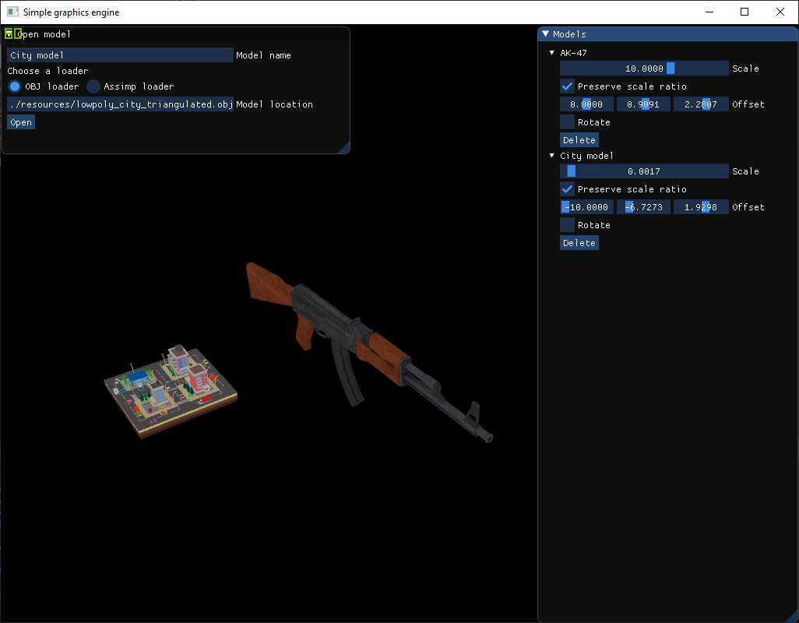

# Simple graphics

Simple graphics engine using **SDL2** and **OpenGL**. Allows you to load 3D models into a demo scene.

Currently has two ways to load models:

- Using my custom loader for `obj` and `mtl` files;
- Using `Assimp` to load `fbx` and other formats.

Here's a screenshot of a demo scene, that contains 2 models: city model is loaded through `obj` and `mtl` files, the AK-47 is loaded through `fbx` file.



The `Assimp` library is quite slow, especially when loading `obj` files. So I wrote my own loader that parses `obj` and `mtl` files using `Boost::Spirit::X3` parsing library. For the demo scene, this changed the city model loading time from `~800ms` to `~13ms` in `RELEASE` mode. In future, I plan to add `fbx` loader, so I can get rid of `Assimp` entirely.

## Dependencies

I use `conan` package manager to pull all the necessary dependecies. All the dependencies this project relies on can be seen in [conanfile.txt](./conanfile.txt).

## Compilation info

To compile, you need to install Conan package manager first. This can be done with `pip`:

```
pip install conan
```

After that, just use CMake to generate the appropriate build files:

```
cd build
cmake .. -DCMAKE_BUILD_TYPE=RELEASE
```

Using generated files, you can compile the project. On OSX/Linux use:

```
cmake --build .
```

On Windows, you have to specify the build type:

```
cmake --build . --config RELEASE
```

Now, enjoy your freshly minted binaries inside the [bin](/bin) folder!

## Cleaning up build files

If you want to clean up the build files and binaries, you can use `git`:

```
git clean -dfX bin build
```

## Launching the app

Internal code uses relative paths for loading models and shaders, so make sure that your working directory is the project root. Here's how you can run the binaries:

```
./bin/simple-graphics
```

## Developing

If you use VSCode `clang-tidy` extension and/or `CPP_TOOLS`, you can generate include file locations for both of them by passing `-DGENERATE_INCLUDE_PATHS=ON` to the `cmake` like this:

```
cmake .. -DCMAKE_BUILD_TYPE=RELEASE -DGENERATE_INCLUDE_PATHS=ON
```
